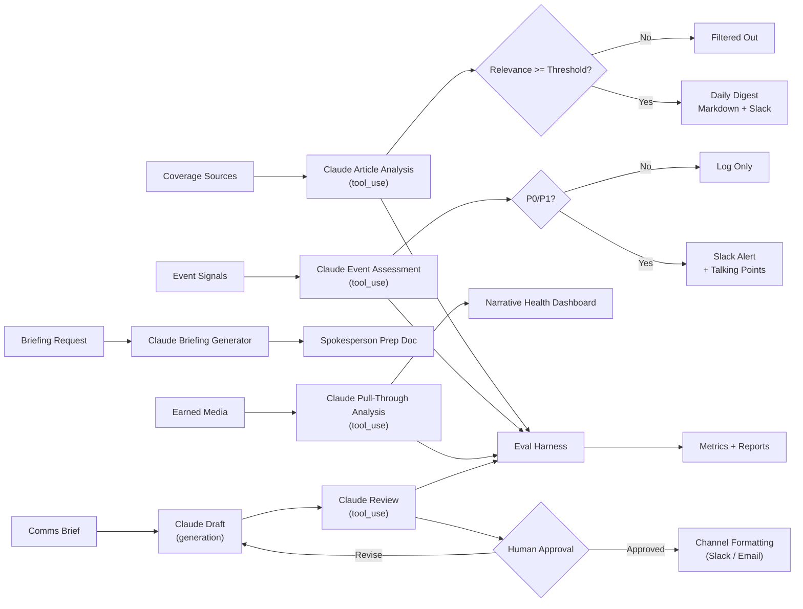

# Comms AI Portfolio: Claude-Powered Communications Workflows

Production-style AI workflows for communications automation, powered by Claude via the Anthropic SDK.

## What This Demonstrates

This project implements five real Claude-powered workflows that a Communications team would use daily:

| Workflow | What It Does | Claude's Role |
|----------|-------------|---------------|
| **Press Digest** | Monitors coverage, filters for relevance, classifies topic/sentiment | Analyzes each article via structured tool_use, writes per-article rationale |
| **Rapid Response** | Triages incoming events, assigns priority tiers, routes to owners | Assesses severity, generates talking points and escalation guidance |
| **Briefing Generator** | Creates spokesperson prep documents for media engagements | Synthesizes coverage + key messages into structured briefings |
| **Pull-Through Tracker** | Measures how Anthropic's key narratives appear in earned media | Analyzes articles against messaging framework, scores fidelity, flags distortions |
| **Internal Comms** | Streamlines drafting, review, and distribution of all-hands content | Three-stage pipeline: draft generation, structured editorial review, channel formatting |

All workflows use Claude's **tool_use** (function calling) for structured outputs — no fragile JSON parsing from freeform text.

Workflows can analyze **live articles** pulled from real RSS feeds (TechCrunch, The Verge, Ars Technica, Wired, MIT Technology Review, The Guardian, VentureBeat) — not just mock data.

## Use Cases: A Day in the Life of a Comms Team

These workflows address real pain points that communications teams face daily at fast-moving AI companies:

**6:30 AM — What happened overnight?**
The **Press Digest** fetches live articles from 7 news sources, has Claude score each for relevance and sentiment, and delivers a prioritized briefing before the team's morning standup. Instead of manually scanning dozens of tabs, the team gets a ranked digest with rationale for why each story matters.

**9:15 AM — A crisis breaks**
A viral social media post or regulatory announcement hits. The **Rapid Response** system triages the event, assigns a P0/P1/P2 tier, generates initial talking points aligned with company values, and recommends who to loop in. The first 30 minutes of a crisis response are no longer spent figuring out *how bad it is* — Claude has already assessed that.

**11:00 AM — Prepping the CEO for a live interview**
The **Briefing Generator** synthesizes recent coverage, key messages, and anticipated tough questions into a spokesperson prep document. What used to take a comms strategist 2-3 hours of research and writing is now a structured first draft in under a minute.

**2:00 PM — Are our messages landing?**
After a product launch or executive interview, the **Pull-Through Tracker** analyzes earned media coverage against the company's messaging framework. It scores how faithfully journalists reflected key narratives, flags distortions, and identifies narrative gaps — turning a subjective "how'd we do?" into quantifiable data.

**4:00 PM — Drafting the all-hands update**
The **Internal Comms** pipeline drafts an all-hands message, runs it through an editorial review that scores tone, clarity, and sensitivity, flags phrases that could be problematic if leaked, and formats the approved content for both Slack and email distribution. The human reviewer gets structured feedback, not just a draft — they know exactly what to fix and why.

## Architecture



## Quickstart

### 1. Setup

```bash
python3 -m venv .venv
source .venv/bin/activate
pip install -r requirements.txt
cp .env.example .env
# Add your ANTHROPIC_API_KEY to .env
```

### 2. Fetch Live Articles (optional)

```bash
python scripts/run_fetch_articles.py --limit 15   # pulls real articles from RSS feeds
```

### 3. Run Press Digest

```bash
python scripts/run_press_digest.py          # uses mock data
python scripts/run_press_digest.py --live   # uses live articles from step 2
cat outputs/press_digest.md
```

### 4. Run Rapid Response

```bash
python scripts/run_rapid_response.py
cat outputs/rapid_response_alerts.json
```

### 5. Run Briefing Generator

```bash
python scripts/run_briefing.py
cat outputs/briefing.md
```

### 6. Run Pull-Through Tracker

```bash
python scripts/run_pull_through.py          # uses mock data
python scripts/run_pull_through.py --live   # uses live articles from step 2
cat outputs/pull_through_report.md
```

### 7. Run Internal Comms Workflow

```bash
python scripts/run_internal_comms.py
cat outputs/internal_comms_report.md
```

### 8. Run Evaluation Suite

```bash
python evals/eval_runner.py
cat outputs/eval_results.json
```

### 9. Run Tests

```bash
python -m unittest discover -s tests -t . -p 'test_*.py'
```

## Sample Outputs

<details>
<summary>Press Digest (excerpt)</summary>

```markdown
# Daily Press Digest

**12 articles selected** | 6 filtered out

### 1. Anthropic expands Claude enterprise tier with SOC 2 compliance
**Source:** TechCrunch | **Relevance:** 10/10 | **Topic:** product | **Sentiment:** positive

> Directly about Anthropic's enterprise strategy. SOC 2 certification is a key
> selling point for regulated industry adoption — the Comms team should amplify this.
```

</details>

<details>
<summary>Rapid Response Alert (excerpt)</summary>

```json
{
  "event_id": "evt-002",
  "tier": "P0",
  "priority_score": 9,
  "rationale": "FTC investigation naming Anthropic directly represents significant regulatory risk...",
  "talking_points": [
    "Anthropic is committed to responsible data practices and welcomes the opportunity to work with regulators.",
    "We have proactive opt-out mechanisms and respect robots.txt for training data collection.",
    "We look forward to engaging constructively with the FTC's inquiry."
  ],
  "escalation_note": "Immediately notify Legal, Policy, and Executive On-Call. Draft holding statement within 30 minutes."
}
```

</details>

<details>
<summary>Spokesperson Briefing (excerpt)</summary>

```markdown
# Spokesperson Briefing: Dario Amodei
**Live Interview** with CNBC Squawk Box | 2026-03-07

## ANTICIPATED QUESTIONS

**Q: OpenAI just launched GPT-5 and it benchmarks competitively with Claude. Are you losing the AI race?**
Framing: Competition makes the field better. We're focused on building the most reliable,
steerable AI — not on winning benchmark races. Enterprise customers choose Claude for
trust and safety, which benchmarks don't fully capture.
```

</details>

<details>
<summary>Pull-Through Report (excerpt)</summary>

```markdown
# Message Pull-Through Report

**Articles analyzed:** 18
**Aggregate pull-through score:** 52%

### safety-leadership [PRIMARY]
> Anthropic is the industry leader in AI safety.

**Score:** 78% [========  ]
**Appearances:** 12 articles
**Distribution:** paraphrased: 6 | thematic: 4 | verbatim: 2
```

</details>

<details>
<summary>Internal Comms Workflow (excerpt)</summary>

```markdown
# Internal Communications Workflow Report

**Content type:** All Hands
**Subject:** Q1 2026 Update and Claude Enterprise Milestones

## Stage 2: Editorial Review

**Tone:** 8/10
**Clarity:** 9/10
**Alignment:** 8/10
**Recommendation:** REVISE

> The draft effectively covers key milestones and maintains an appropriate tone.
> However, the FTC section could be more carefully worded to avoid implying
> the investigation is routine. Suggest strengthening the "what we don't know"
> framing.

### Sensitivity Flags
- "cooperating fully" may imply prior non-cooperation
- FTC paragraph placement at the end could seem like burying the lede
```

</details>

## Evaluation Results

The eval harness runs Claude against human-labeled datasets and reports:

| Metric | Target | Description |
|--------|--------|-------------|
| Relevance accuracy (within 2 pts) | >80% | How close is Claude's relevance score to human judgment? |
| Topic classification accuracy | >75% | Does Claude categorize articles the same way humans do? |
| P0 recall | >95% | Does Claude catch every true crisis? |
| P0 false positive rate | <15% | Does Claude over-escalate? |
| Pull-through score range accuracy | >80% | Does Claude's pull-through score fall within human-labeled ranges? |
| Distortion detection recall | >75% | Does Claude catch when journalists twist key messages? |
| Internal comms recommendation accuracy | >75% | Does Claude's approve/revise/escalate match human judgment? |
| Sensitivity detection accuracy | >75% | Does Claude flag sensitive content that needs legal review? |

Run `python evals/eval_runner.py` to generate a full report.

## Repo Structure

```
.
├── data/                         # Mock datasets + labeled eval data
│   ├── articles.json             # 18 sample press articles
│   ├── events.json               # 8 sample communications events
│   ├── briefing_request.json     # Sample briefing input
│   ├── key_messages.json         # Anthropic key messaging framework
│   ├── internal_comms_request.json # Sample internal comms brief
│   ├── eval_articles_labeled.json# Human-labeled article eval set
│   ├── eval_events_labeled.json  # Human-labeled event eval set
│   ├── eval_pull_through_labeled.json # Human-labeled pull-through eval set
│   └── eval_internal_comms_labeled.json # Human-labeled internal comms eval set
├── docs/                         # Architecture and training docs
├── evals/                        # Evaluation harness + scoring rubrics
│   ├── eval_runner.py            # Runnable eval script
│   └── *.yaml                    # Metric specs for CI gating
├── playbook/                     # Replicable comms automation playbook
├── sources/                      # Live data ingestion (RSS fetcher)
├── scripts/                      # Entry points for each workflow
├── src/comms_ai_portfolio/       # Core implementation
│   ├── claude_client.py          # Anthropic SDK wrapper with tool schemas
│   ├── press_digest.py           # Press digest workflow
│   ├── rapid_response.py         # Rapid response workflow
│   ├── briefing_generator.py     # Briefing generator workflow
│   ├── pull_through_tracker.py   # Message pull-through tracker
│   ├── internal_comms.py         # Internal comms workflow (draft/review/format)
│   ├── slack_output.py           # Slack webhook delivery
│   └── models.py                 # Data models
├── tests/                        # Integration tests (calls Claude API)
└── outputs/                      # Generated artifacts
```

## Design Decisions

- **Tool_use for structured output**: Guarantees valid JSON conforming to defined schemas, not brittle freeform text parsing. This is the production-grade pattern for LLM integrations.
- **Per-decision rationale**: Every article score and event tier includes Claude's reasoning, making the system auditable and building trust with non-technical stakeholders.
- **Human-in-the-loop by default**: P0/P1 alerts, briefings, and internal comms require human review. The internal comms pipeline has an explicit review gate — Claude drafts, Claude reviews with structured feedback, but a human must approve before distribution.
- **Eval-driven development**: Labeled datasets and automated scoring ensure quality is measured, not assumed.
- **Replicable playbook**: The `playbook/` documents workflows, rollout plans, KPIs, and governance so other teams can adapt these patterns.

## Safety

- No embedded credentials or API keys
- Mock/synthetic data included (safe for public sharing); live data fetched from public RSS feeds
- Configuration via `.env` file
- System prompts designed to prevent generation of harmful or dishonest content
- All Claude outputs marked as AI-generated recommendations requiring human review

## License

MIT (see `LICENSE`).
