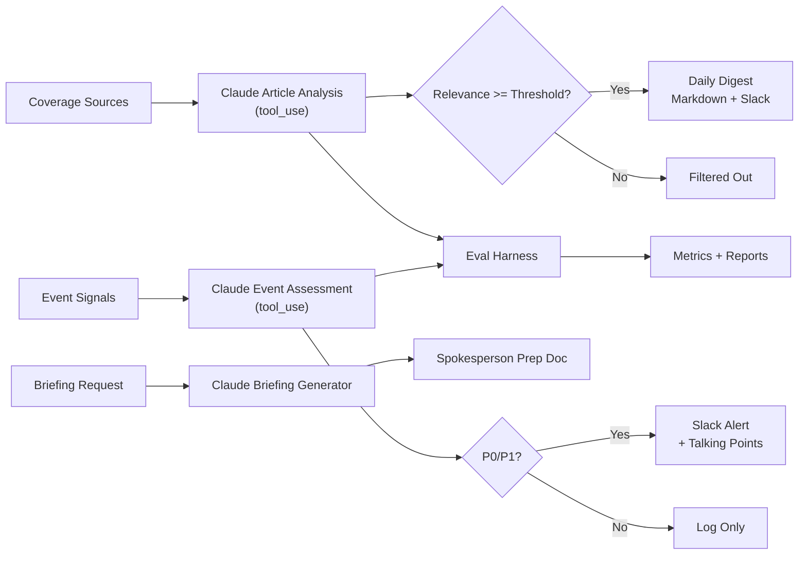

# Comms AI Portfolio: Claude-Powered Communications Workflows

Production-style AI workflows for communications automation, powered by Claude via the Anthropic SDK.

## What This Demonstrates

This project implements three real Claude-powered workflows that a Communications team would use daily:

| Workflow | What It Does | Claude's Role |
|----------|-------------|---------------|
| **Press Digest** | Monitors coverage, filters for relevance, classifies topic/sentiment | Analyzes each article via structured tool_use, writes per-article rationale |
| **Rapid Response** | Triages incoming events, assigns priority tiers, routes to owners | Assesses severity, generates talking points and escalation guidance |
| **Briefing Generator** | Creates spokesperson prep documents for media engagements | Synthesizes coverage + key messages into structured briefings |

All workflows use Claude's **tool_use** (function calling) for structured outputs — no fragile JSON parsing from freeform text.

## Architecture



## Quickstart

### 1. Setup

```bash
python3 -m venv .venv
source .venv/bin/activate
pip install -r requirements.txt
cp .env.example .env
# Add your ANTHROPIC_API_KEY to .env
```

### 2. Run Press Digest

```bash
python scripts/run_press_digest.py
cat outputs/press_digest.md
```

### 3. Run Rapid Response

```bash
python scripts/run_rapid_response.py
cat outputs/rapid_response_alerts.json
```

### 4. Run Briefing Generator

```bash
python scripts/run_briefing.py
cat outputs/briefing.md
```

### 5. Run Evaluation Suite

```bash
python evals/eval_runner.py
cat outputs/eval_results.json
```

### 6. Run Tests

```bash
python -m unittest discover -s tests -p 'test_*.py'
```

## Sample Outputs

<details>
<summary>Press Digest (excerpt)</summary>

```markdown
# Daily Press Digest

**12 articles selected** | 6 filtered out

### 1. Anthropic expands Claude enterprise tier with SOC 2 compliance
**Source:** TechCrunch | **Relevance:** 10/10 | **Topic:** product | **Sentiment:** positive

> Directly about Anthropic's enterprise strategy. SOC 2 certification is a key
> selling point for regulated industry adoption — the Comms team should amplify this.
```

</details>

<details>
<summary>Rapid Response Alert (excerpt)</summary>

```json
{
  "event_id": "evt-002",
  "tier": "P0",
  "priority_score": 9,
  "rationale": "FTC investigation naming Anthropic directly represents significant regulatory risk...",
  "talking_points": [
    "Anthropic is committed to responsible data practices and welcomes the opportunity to work with regulators.",
    "We have proactive opt-out mechanisms and respect robots.txt for training data collection.",
    "We look forward to engaging constructively with the FTC's inquiry."
  ],
  "escalation_note": "Immediately notify Legal, Policy, and Executive On-Call. Draft holding statement within 30 minutes."
}
```

</details>

<details>
<summary>Spokesperson Briefing (excerpt)</summary>

```markdown
# Spokesperson Briefing: Dario Amodei
**Live Interview** with CNBC Squawk Box | 2026-03-07

## ANTICIPATED QUESTIONS

**Q: OpenAI just launched GPT-5 and it benchmarks competitively with Claude. Are you losing the AI race?**
Framing: Competition makes the field better. We're focused on building the most reliable,
steerable AI — not on winning benchmark races. Enterprise customers choose Claude for
trust and safety, which benchmarks don't fully capture.
```

</details>

## Evaluation Results

The eval harness runs Claude against human-labeled datasets and reports:

| Metric | Target | Description |
|--------|--------|-------------|
| Relevance accuracy (within 2 pts) | >80% | How close is Claude's relevance score to human judgment? |
| Topic classification accuracy | >75% | Does Claude categorize articles the same way humans do? |
| P0 recall | >95% | Does Claude catch every true crisis? |
| P0 false positive rate | <15% | Does Claude over-escalate? |

Run `python evals/eval_runner.py` to generate a full report.

## Repo Structure

```
.
├── data/                         # Mock datasets + labeled eval data
│   ├── mock_articles.json        # 18 realistic press articles
│   ├── mock_events.json          # 8 communications events
│   ├── briefing_request.json     # Sample briefing input
│   ├── eval_articles_labeled.json# Human-labeled article eval set
│   └── eval_events_labeled.json  # Human-labeled event eval set
├── docs/                         # Architecture and training docs
├── evals/                        # Evaluation harness + scoring rubrics
│   ├── eval_runner.py            # Runnable eval script
│   └── *.yaml                    # Metric specs for CI gating
├── playbook/                     # Replicable comms automation playbook
├── scripts/                      # Entry points for each workflow
├── src/comms_ai_portfolio/       # Core implementation
│   ├── claude_client.py          # Anthropic SDK wrapper with tool schemas
│   ├── press_digest.py           # Press digest workflow
│   ├── rapid_response.py         # Rapid response workflow
│   ├── briefing_generator.py     # Briefing generator workflow
│   ├── slack_output.py           # Slack webhook delivery
│   └── models.py                 # Data models
├── tests/                        # Integration tests (calls Claude API)
└── outputs/                      # Generated artifacts
```

## Design Decisions

- **Tool_use for structured output**: Guarantees valid JSON conforming to defined schemas, not brittle freeform text parsing. This is the production-grade pattern for LLM integrations.
- **Per-decision rationale**: Every article score and event tier includes Claude's reasoning, making the system auditable and building trust with non-technical stakeholders.
- **Human-in-the-loop by default**: P0/P1 alerts and briefings always require human review. The system recommends, humans decide.
- **Eval-driven development**: Labeled datasets and automated scoring ensure quality is measured, not assumed.
- **Replicable playbook**: The `playbook/` documents workflows, rollout plans, KPIs, and governance so other teams can adapt these patterns.

## Safety

- No embedded credentials or API keys
- Mock/synthetic data only (safe for public sharing)
- Configuration via `.env` file
- System prompts designed to prevent generation of harmful or dishonest content
- All Claude outputs marked as AI-generated recommendations requiring human review

## License

MIT (see `LICENSE`).
